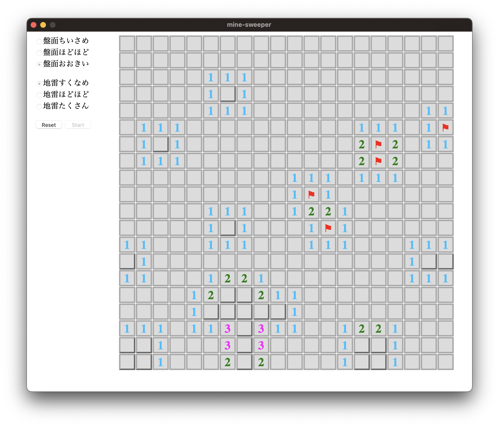

# Mine Sweeper

Multiplatform GUI application.

## Tauri ( Rust ) + React ( Typescript )

### Boot

```
$ make dev
```

or

```
$ yarn tauri dev
```

### Test

```
$ make test
```

or

```
$ cd src-tauri
$ cargo test
```

#### Result

```
running 6 tests
test game::tests::flag ... ok
test game::tests::rounds_left_top ... ok
test game::tests::rounds_right_bottom ... ok
test game::tests::rounds_center ... ok
test game::tests::sweep ... ok
test game::tests::mines ... ok

test result: ok. 6 passed; 0 failed; 0 ignored; 0 measured; 0 filtered out; finished in 0.03s
```

### Require

- yarn
- cargo

## Screen Shot

### Small Board


### Large Board


